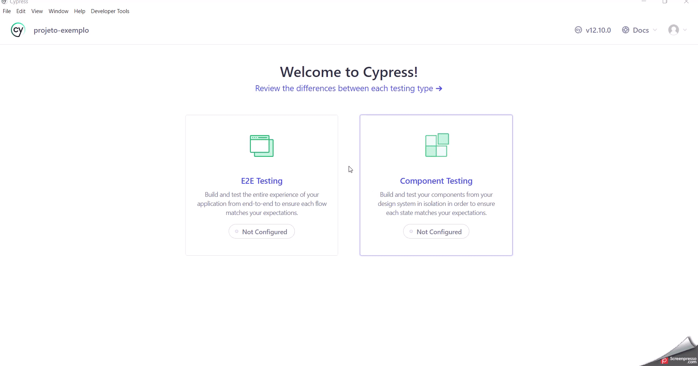

# Testes Automatizados e Manuais usando como base o formulário de inscrição do Beedoo ###

## Descrição dos Testes Automatizados

* O formulário de inscrição do Beedoo é acessado através do site 'https://beedoo.com.br/' rolando a 
página até seu rodapé e clicando em "Envie seu currículo" na opção "Faça Parte". Onde é aberto uma
nova aba que abre o site  onde podemos preeencher o 
formulário de inscrição com os dados e anexar um arquivo contendo um currículo com o objetivo de 
concorrer a uma possível vaga de trabalho.'https://app.pipefy.com/public/form/NWn55kc1'

# 🚀 Começando

## 📋 Pré condições 

### Clona o projeto do Github em 'http://github.com/beedootestes/qa':
 - No terminal digita o comando: git clone git@github.com:beedootestes/qa.git

### Cria um projeto Node:
 - No terminal digita o comando: npm init --yes 

 - No terminal digita o comando: npm install

### Instala o Cypress e a estrutura padrão de pastas:
 - No terminal digita o comando: npm install Cypress 

### Inicia o test runner do cypress para configuração padrão de testes:
 - No terminal digita o comando: npm cypress open
 - Com o cypress aberto: clica em "E2E Testing", "continue" , seleciona o Browser "Electron" e clica em:
 "Start E2E Testing in Electron", "Create new Spec" , "Okay, run the spec" para rodar um exemplo.

# ⚙️ Estrutura dos testes

## Estrutura do teste frontEnd './cypress/e2e/GUI/frontendGUI.cy.js

## 📋  Pré requisitos

### 🔧 Instalação das Dependencias:

### Usei o plugin 'cypress-plugin-steps' para adicionar passos ao teste
 - No terminal digita o comando: npm install cypress-plugin-steps -D 
 - Em './cypress/support/e2e.js': import 'cypress-plugin-steps'

### Usei o ' @faker-js/faker' para gerar dados randômicos para serem usados no preenchimento do formulário
 - No terminal digita o comando: npm install @faker-js/faker --save-dev

### Para ativar o uso do comando 'cy.origin()':
 - Em 'cypress.config.js': "experimentalSessionAndOrigin: true"

### Comando customizado  'cy.preencheFormularioAnexaCurriculoESubmete()':

#### Para utilizar um comando customizado nos testes:
 - Em './cypress/support/e2e.js': import './commands'

### Criei um comando customizado em './cypress/support/commands.js' com as seguintes caracteristicas:
 - No site 'https://beedoo.com.br/', ao clicar em  "Envie seu currículo" na opção "Faça Parte", o navegador abre uma nova aba acessando assim o site 'https://app.pipefy.com/public/form/NWn55kc1'. Mesmo removendo o "attr" "target" do elemento para que o cypress abra na mesma aba do navegador, foi necessário a utilização do cy.origin() pois, a nova aba abre na mesma aba do navegador, mas o dominio do site é outro.
 - A Estrutura foi baseada na documentação oficial do cypress em:
  - https://docs.cypress.io/api/commands/origin#docusaurus_skipToContent_fallback
 - Para anexar um arquivo contendo o curriculo a ser anexado no teste, foi adicionado à pasta fixture o arquivo de exemplo 'curriculo.pdf' 

## Estrutura do teste backEnd './cypress/e2e/API/backendApiStatus.cy.js' 

## 📋  Pré requisitos:

- Acessar a api 'https://randomuser.me/api/' utilizando o método GET

- Utilizei a função nativa do cypress 'cy.request' para validar o status code de retorno da requisição

## Estrutura do teste backEnd './cypress/e2e/API/backendApiContract.cy.js' 

## 📋  Pré requisitos

### 🔧 Instalação das Dependencias:

- Para comparar apenas as propriedades e não os valores, utilizei a função 'isEqual' da biblioteca  'lodash' em conjunto com a função 'keys' para comparar as chaves dos objetos. Dessa forma, verifiquei que ambos os objetos têm as mesmas chaves, sem se importar com os valores dessas chaves.
  #### No terminal digita o comando: npm install lodash

### Criação da fixture './cypress/fixtures/randomUserApiResponse.json':

#### Para fazer o teste de validação de contrato , criei na fixture o arquivo 'randomUserApiResponse.json' utilizando a ferramenta 'Postman':
 - Acessar a ferramenta 'Postman';
 - Metódo 'GET';
 - Digita url da api 'https://randomuser.me/api/' e clica em 'Send';
 - Na aba 'Body', copia seu conteúdo;
 - Cria o arquivo 'randomUserApiResponse.json' e cola o conteúdo.
 

 # ⚙️ Execução dos Testes automatizados

## 📋 Scripts:
 
### Foi criado na 'package.json' os seguintes scripts para facilitar a execução dos testes:

 #### Para abrir o test runner do cypress:
  - No terminal digita o comando: npm test 
  - Seleciona "E2E Testing", seleciona "Electron", clica em "Start E2E Testing in Electron"
    - Pode executar os testes de maneira individual ou clica em "E2E specs" "Run 3 specs" pra executar todos ao mesmo tempo.
	- Para isso utilizamos o "experimentalRunAllSpecs: true" em: 'cypress.config.js' 
  

 #### Para executar todos os testes em 'headless':
  - No terminal digita o comando: npm run headless

 #### Para executar os testes em headless separadamente:
  - No terminal digita o comando: npm run headless_frontendGUI
  - No terminal digita o comando: npm run headless_ApiStatus
  - No terminal digita o comando: npm run headless_ApiContract

 #### Para executar todos os testes em headless simulando um dispositivo móvel (mobile):
  - No terminal digita o comando: npm run test:mobile

## Evidência dos testes automatizados

### Geração dos vídeos de execução dos testes automatizados:

### Para a geração dos vídeos de execução dos testes:
 - #### Em 'cypress.config.js': "video: true" // Por Default fica false
 - #### Também usei o programa 'Screenpresso' para gravar a tela na execução dos testes
### As evidências de todos os testes rodando:
  - './qa/automationTestEvidencies/allTestsEvidencies
#### As evidências dos testes GUI:
  - './qa/automationTestEvidencies/guiEvidencies'
#### As evidências dos testes API: 
  - './qa/automationTestEvidencies/apiEvidencies'

## 🛠️ Construído com

- Cypress - Framework de testes (versão 12.9.0)

- Node.js - Ambiente de execução JavaScript (versão 18.15.0)

- Postman - Para gerar o arquivo json na fixture (versão 10.13.4)

- GitBash - Terminal (versão 2.38.1)

- Visual Studio Code - IDE (versão 1.77.3)

# Descrição dos testes manuais

### Toda a documentação está na Pasta './qa/manualTests/UserStoryBeedoo.txt'

* #### As evidências dos teste manuais estão em './qa/manualTests/manualTestEvidencies'
* #### A massa de dados com os arquivos utilizados nos testes estão em ./qa/manualTests/testDataManagement'

## ✒️ Autor

Rafael Domingos Santos (Q.A Analist)

https://github.com/Raffadom 

https://www.linkedin.com/in/rafael-domingos-aab12060/ 

